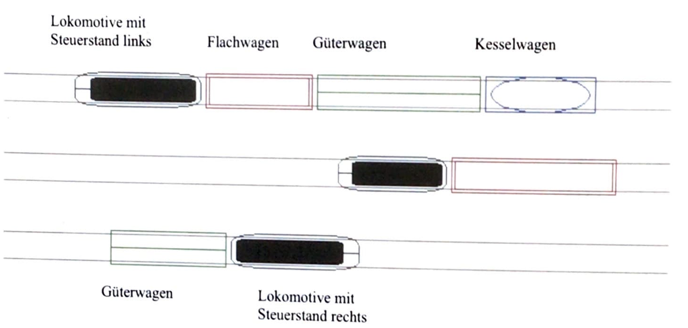
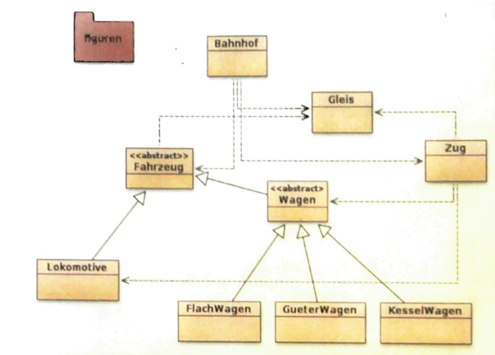
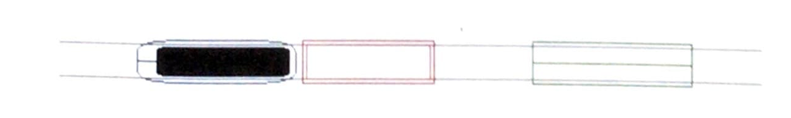
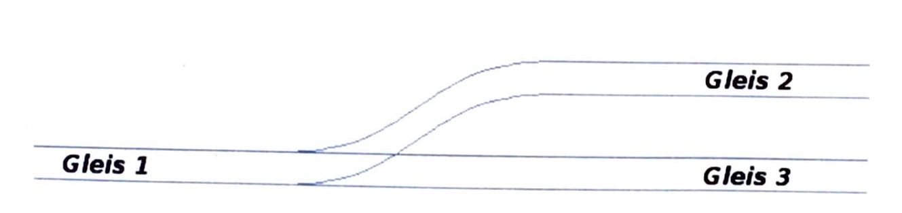
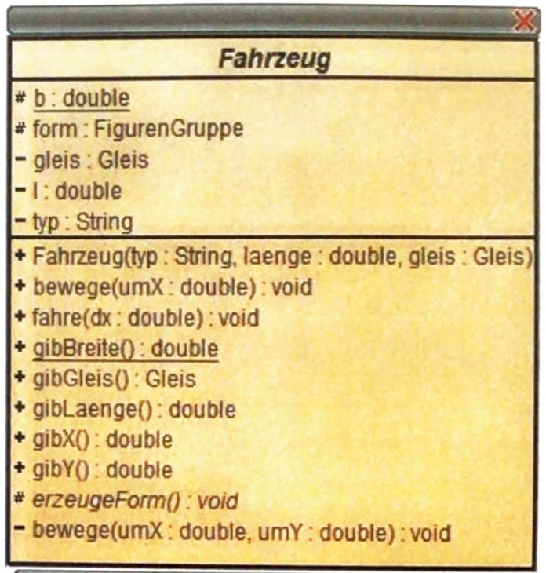
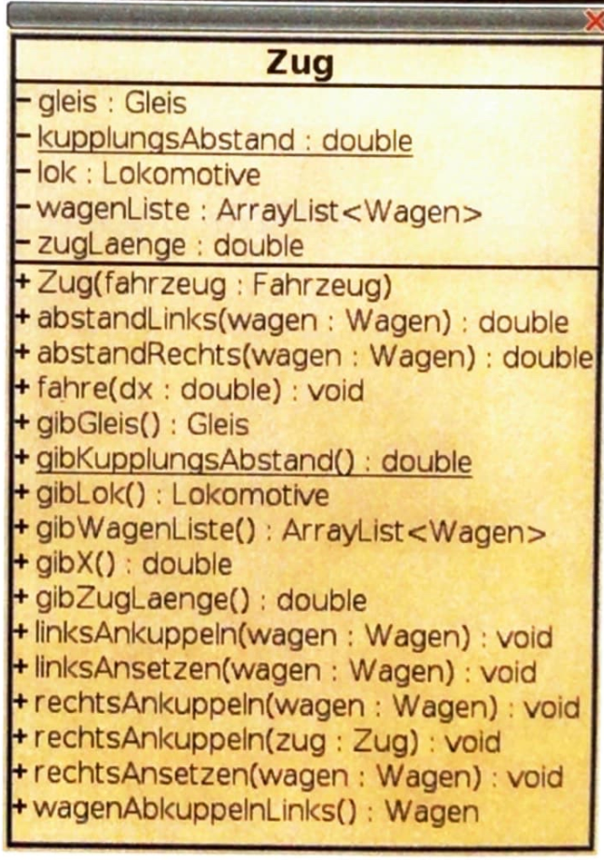
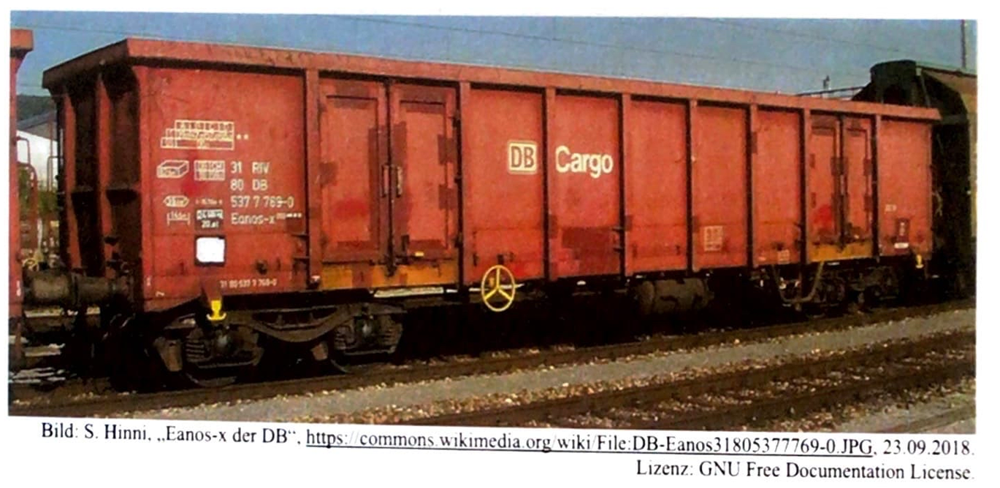

# Informatik Abituraufgabe OOP 2019

\[01.02.2023\] Tim Gabrikowski

Aufgabe I: Darstellung einer Gleisanlage

Schwerpunktthema: Objektorientierte Modellierung und Programmierung von Grafiksystemen

> Der Arbeitsablauf des Rangierens auf der Gleisanlage eines Bahnhofs soll mit einfachen Mitteln grafisch dargestellt werden. Das folgende Bild (Abbildung 1) zeigt drei Gleise. Auf dem oben dargestellten Gleis ist eine Lokomotive mit dem Steuerstand links abgebildet, an die ein Flachwagen, ein Güterwagen mit Aufbau und ein Kesselwagen angehängt worden sind. An die Lokomotive auf dem mittleren Gleis ist ein Flachwagen mit anderer Länge angehängt, auf dem unteren ein Güterwagen (mit Aufbau) an eine Lokomotive mit Steuerstand rechts.
>
> 
> Abbildung 1
>
> Das Klassendiagramm eines ersten Entwurfs für das Programm, welches den Arbeitsablauf des Rangierens darstellt ist in Abbildung 2 auf der folgenden Seite zu sehen. Die für die grafische Darstellung verwendeten Klassen sind in ein Paket **figuren** ausgegliedert, von dem die Klasse `Figur` und die davon abgeleiteten Klassen `Linie`, `Rechteck`, `AbgerundetesRechteck`, `Ellipse` und `ZusammengesetzteFigur` verwendet werden. Das Paket ermöglicht sowohl die Darstellung von Umrissen als auch von gefüllten Figuren. In der Anlage 1 zu dieser Aufgabe finden Sie zudem die Klassenkarten zu den Klassen `Fahrzeug` und `Zug`.
>
> 
> Abbildung 2

## Aufgabenteil A

> - **Beschreiben** Sie die Begriffe Objekt und Klasse am Beispiel der im Gleisbild (Abbildung 1) gezeigten Flachwagen und der zugehörigen Klasse `FlachWagen` (siehe Abbildung 2).

Eine Klasse ist eine Beschreibung eines Objektes, sein Bauplan. In ihr werden die Funktionen und Werte deklariert, welche genutzt werden können. Die Klasse `FlachWagen` in diesem Beispiel beschreibt welche Funktionen ein Flachwagen hat oder welche Werte er besitzt. Ein Objekt ist eine Instanz einer Klasse. Es hat die in der Klasse, dem Bauplan, beschriebenen Funktionen und Werte und kann diese nutzen. Es kann auf den Gleisen mehrere Flachwagen geben, also mehrere Objekte aber es gibt nur einen Bauplan, eine Klasse, die beschreibt wie ein Flachwagen aussieht und funktioniert.

## Aufgabenteil B

> - **Beschreiben** Sie beispielhaft die im dargestellten Klassendiagram auftretenden Beziehungstypen und **erläutern** Sie diese aus dem Problem (Kontext) heraus.

Im Klassendiagramm gibt es zwei Beziehungstypen. Es gibt die _benutzt/hat-Beziehungen_ und die _ist ein-Beziehungen_. Benutzt- oder hat-Beziehungen treten immer dann auf, wenn ein Objekt einer Klasse, oder die Klasse selbst, ein Objekt einer anderen Klasse benutzt oder hat. Im Kontext ist eine Hat-Beziehung zum Beispiel, dass ein Zug eine Lokomotive und einen (oder mehrere) Wagen hat. Ein Objekt der Klasse `Zug` hat Objekte der Klasse `Lokomotive` oder `Wagen`. Ein Beispiel für eine _Benutzt-Beziehung_ wäre folgendes:

Ein Zug benutzt ein Gleis. Er fährt auf ihm. Das Objekt der Klasse `Zug` speichert also ein Objekt der Klasse `Gleis` und arbeitet damit.

Der andere Beziehungstyp ist eine _ist-Beziehung_. Diese taucht überall da auf, wo eine Klasse Methoden und Variablen von einer anderen Klasse erbt und dadurch die Oberklasse um weitere, spezifischere Funktionen erweitert.

Im Kontext gibt es eine solche Beziehung beispielsweise zwischen `Wagen` und `Fahrzeug` oder zwischen `Lokomotive` und `Fahrzeug`. Eine Lokomotive ist ein Fahrzeug und hat alle Funktionen eines Fahrzeugs, erweitert diese aber um um Beispiel einen Antrieb oder einen Fahrer, also weitere Funktionen.

## Aufgabenteil C

> Wenn ein Zug zusammengestellt werden soll, muss die Lokomotive mit gegebenenfalls schon anhängenden Wagen an den neu anzuhängenden Wagen bis auf den Kupplungsabstand schrittweise langsam herangefahren sein und der Wagen dann mit dem Zug verbunden werden. Betrachten Sie die für die folgende Teilaufgabe nur den Fall, bei dem der Zug links an den rechts stehenden Wagen heranfahren muss (Siehe Abbildung 3).
>
> 
>
> Für das Fahren des gesamten Zuges stellt die Klasse `Zug` folgende Methode bereit:

```java
/*
* bewege den Zug um dx nach rechts
* @param dx Strecke
*/
public void fahre (double dx) {
	lok.fahre(dx);
	for(Wagen wagen : wagenListe) wagen.fahre(dx);
}
```

> - **Analysieren** Sie die gegebene Methode. Gehen Sie dabei auf die verwendeten Datenstrukturen und Programmstrukturen ein.
> - Die Methode `public void rechtsAnkuppeln(Wagen wagen)` der Klasse `Zug` soll zunächst alle Vorbedingungen prüfen, die erfüllt sein müssen, damit sie ihre Aufgabe erledigen kann. **Bestimmen** und **beschreiben** Sie diese Vorbedingungen.
> - **Implementieren** Sie diese Methode `public void rechtsAnkuppeln(Wagen wagen)` der Klasse `Zug`.

Die Methode `fahre` ist _public_, also von überall aufrufbar. Sie nimmt einen Parameter _dx_ vom Datentypen _double_ entgegen und liefert keinen Wert zurück, also _void_. Zuerst ruft die Methode die Funktion `fahre` von der Instanzvariable _lok_ auf und übergibt die Variable _dx_. Als nächstes iteriert die Methode mit einer erweiterten _for-Schleife_ über alle Elemente in der ArrayList _wagenListe_. Für jeden Wagen in der Liste erstellt sie eine Variable vom Typ _Wagen_ und dem Namen _Wagen_. Dann ruft sie von jedem Wagen die `fahre` Methode auf und übergibt die Variable _dx_.

Die eine Bedingung ist, dass der Zug und der Wagen auf dem selben Gleis sein müssen. Da in diesem Fall aber nur ein Gleis exitsiert, ist diese Bedingung immer gegeben. Die zweite bedingung ist, dass der Zug bis auf den Kupplungsabstand an den neuen Wagen herangefahren sein muss, da er diesen sonst nicht anhängen kann. Dies ist erfüllt, wenn der Rückgabewert der Funktion `abstandRechts` gleich der Variable `kupplungsAbstand` ist. Wenn diese Bedingung nicht erfüllt ist, fährt der Zug nach rechts um sie zu erfüllen.

```java
public void rechtsAnkuppeln(Wagen wagen) {
	double dR = abstandRechts(wagen);
	if(dR != kupplungsAbstand) {
		fahre(dR - kupplungsAbstand);
	}
	wagenListe.add(wagen);
}
```

Zu beachten ist, dass sich der Zug mit dieser Funktion nicht nur dem Wagen nähert, sollte er zu weit weg sein, sondern sich auch entfernt, sollte er zu nahe dran sein, da in diesem Fall `dR - kupplungsAbstand < 0` ist und der Zug somit um eine negativ Strecke nach rechts, also um eine positive Strecke nach links bewegt wird.

## Aufgabenteil D

> Die folgende Methode dient zum Positionieren von weiteren Fahrzeugen auf einem Gleis:

```java
/*
* bewegt das Fahrzeug um dx nach rechts
*/
public void bewege (double umX) {
	form.bewege (umX, 0);
}
```

> Die Methode arbeitet jedoch nicht fehlerfrei, da es passieren kann, dass sich das bewegte Fahrzeug mit vorhandenen Fahrzeugen überschneidet. Damit dies nicht passiert, muss der Abstand der Fahrzeuge mindestens so groß wie der Kupplungsabstand sein.
>
> - **Untersuchen** Sie, welche Ergänzungen im Programm notwendig sin, damit das Einhalten dieser Bedingung vom Programm geprüft werden kann.
> - **Implementieren** Sie eine Methode `public boolean frei()` für das Prüfen und **geben** Sie außerdem **an**, wie sie in der Klasse `Fahrzeug` verwendet werden soll.

Um diese Bedingung zu prüfen muss unser Fahrzeug seine Umgebung kennen, um zu wissen welchen Abstand es zu andere Wagen bzw. Fahrzeugen hat. Dies könnte über eine Liste am Gleis realisiert werden, in der alle Fahrzeuge eingetragen werden, die auf dem Gleis sind. Immer wenn ein neues Fahrzeug auf ein Gleis kommt sagt es dem Gleis Bescheid und wird an der richtigen Stelle in die Liste eingefügt.

Die Methode zum überprüfen kann sich dann aus der Liste über eine Methode `gibNaechsten(Fahrzeug fahrzeug)` der Klasse `Gleis` das nächste Fahrzeug holen. Der Parameter der Funktion ist das Fahrzeug von dem aus das nächste genommen werden soll. Die `frei` Methode kann dann über die Positionen der Fahrzeuge ihren Abstand bestimmen und somit die maximale Strecke, die es zurücklegen darf berechnen.

Wichtig zu beachten ist, dass in die Berechnung der Abstände auch die Längen der Fahrzeuge einfließen müssen, genauer gesagt die halben Längen, da diese nicht unendlich kurz sind. Diese Abstandsberechnung wird allerdings leichter, da wir den _y_-Versatz ignorieren können, da er _0_ ist.

Daraus ergibt sich folgende Formel für den Maximalen Weg den das Fahrzeug fahren kann:

$$
s_{max} = X_2 - x_1 - \frac{l_2}{2} - \frac{l_1}{2} - s_{min}
$$

- $x_1$: X Position des aktuellen Fahrzeugs
- $x_2$: X Position des anderen Fahrzeugs
- $l_1$: Länge des aktuellen Fahrzeugs
- $l_2$: Länge des anderen Fahrzeugs
- $s_{min}$: Minimaler Abstand (`kupplungsAbstand`)

Die `frei` Methode muss also dann die maximale Strecke ($s_{max}$) berechnen und mit der zu fahrenden Strecke vergleichen. Wenn die zu fahrende Strecke kleiner oder gleich ist, darf gefahren werden, wenn sie größer ist, dann würde es zu einem Unfall kommen und es darf deshalb nicht gefahren werden.

Die `frei` Methode holt sich also das nächste Fahrzeug vom Gleis, berechnet den maximal möglichen Weg und schaut wie weit gefahren werden soll und liefert `true` zurück, wenn dies möglich ist.

```java
public boolean frei (double sX) {
	Fahrzeug nF = gleis.gibNaechstes();
	double x1 = gibX();
	double x2 = nF.gibX();
	double l1 = gibLaenge();
	double l2 = nF.gibLaenge();
	double sMin = Zug.gibKupplungsAbstand();

	double sMax = x2 - x1 - (l2/2) - (l1/2) - sMin;
	return sX <= sMax;
}
```

Diese Funktion wird in der `bewege` Funktion vom Fahrzeug in einem _if-Block_ als Bedingung zum Bewegen des Fahrzeugs aufgerufen:

```java
public void bewege (double umX) {
	if(frei(umX)) {
		form.bewege(umX, 0);
	}
}
```

<br>
<br>
<br>

## Aufgabenteil E

> Beim Rangieren kann es vorkommen, dass eine Lokomotive eine andere Lokomotive ziehen muss, so dass es möglich werden soll, dass diese wie andere Fahrzeuge auch in den Zug eingebaut werden kann.
>
> - **Untersuchen** Sie, wie die Klassenkarte von `Zug` verändert werden muss, damit eine Lokomotive wie andere Fahrzeuge auch in den Zug eingebaut werden kann.

Um diese Funktionalität einzubauen können wir zum einen die Variable _lok_ der Klasse `Zug` zu einer Liste ändern, in der alle Lokomotiven vermerkt sind, aber da es sein kann, dass die Loks zwischen Wagen stehe und nicht alle direkt hintereinander, wäre dieser Ansatz zu kompliziert, da wir die Positionen der Loks in der Wagenreihung speichern und beachten müssten.

Einfacher ist es, wenn wir uns das Prinzip der Polymorphie zunutze machen. Da sowohl `Wagen` als auch `Lokomotive`n von der Oberklasse `Fahrzeug` abstammen, können wir den Datentypen unserer _wagenListe_ zu einer ArrayListe vom Typ `Fahrzeug` ändern. Dadurch ändert sich direkt auch die `gibWagenLänge` Funktion bzw. Ihr Datentyp. Auch die ganzen Funktionen zum An- und Abkuppeln ändern ihren Datentypen und ihre Parameter. Alle Variablen vom Typ `Wagen` werden zum Typ `Fahrzeug`.

Wenn das getan ist, kann man noch drüber diskutieren ob man die Variable _lok_ weglässt und einfach sagt, die Haupt-Lok des Zuges ist das erste Element in der Wagen-Liste bzw. die erste Lokomotive in der Liste. Hierbei kommt es darauf an, welche Funktionen die Lok gegenüber den Wagen hat und wie diese genutzt werden um den Zug zu bewegen.

## Aufgabenteil F

> Das Modell enthält die abstrakte Klasse `Wagen` mit dem nachfolgenden Klassentext:

```java
public abstract class Wagen extends Fahrzeug {
	/*
	* Kopnstruktor für Objekte der Klasse Wagen
	*/
	public Wagen (String wagentyp, double laenge, Gleis gleis) {
		super (wagentyp, laenge, gleis);
	}
}
```

> Die Überlegung zu ihrer Einführung beim Entwurf ist gewesen, dass schon die Namen der eingeführten Wagenklassen auf gemeinsame Eigenschaften hindeuten (die z.B. Lokomotiven nicht haben).
>
> - **Entwickeln** Sie eine Erweiterung der Klasse `Wagen` um eine Eigenschaft (Attribut und zugehörige Methoden), die von anderen Fahrzeugen (wie z.B. Lokomotiven) nicht benötigt wird.

Ich habe mich für einen Tankwagen entschieden, dieser hat eine bestimmte Flüssigkeit geladen und speichert ihren Namen als _String_ und seinen Füllstand als _double_.

```java
class TankWagen extends Wagen {
	private String fluessigkeit;
	private double fuellstand;
	public TankWagen (String fl, double fs, Gleis gleis) {
		super("TankWagen", 15.0, gleis); // Typ, Länge, Gleis
		fluessigkeit = fl;
		fuellstand = fs;
	}
	public String gibFluesigkeit () {
		return fluessigkeit;
	}
	public double gibFuellstand () {
		return fuellstand;
	}
}
```

## Aufgabenteil G

> Eine Weiche stellt für die Modellierung und für die Darstellung der Bewegung des Zugs besondere Anforderungen.
>
> 
> Abbildung 5
>
> - **Untersuchen** Sie am Beispiel eines der in Abbildung 1 dargestellten einfachen Züge die besonderen Anforderungen.

Das erste Problem, welches auffällt ist, dass durch die Weiche die Wagen eines Zuges aud unterschiedlichen Gleisen sind. Dies ist zwar aus Sicht der Wagen möglich, weil diese selbst speichern auf welchem Gleis sie sind, aber aus der Sicht des Zuges ist es schwierig.

Auch ist das Anzeigen der Züge in einer Grafik sowie das bewegen der Wagen schwieriger, weil nun die Bewegung in zwei Dimensionen und auf Diagonalen und sogar um Radien herum berechnet werden muss. Noch dazu müsste die korrekte Rotation des Zuges bzw. des Wagens bestimmt und die Abstände zu den anderen Wagen in den Kurven neu berechnet werden.

Dise Züge in Abbildung 1 bewegen sich 1-dimensional auf einer Linie. Sie brauchen sich nicht drehen oder nach oben/unten verschieben. Auf einer Linie bewegen müssen sie können. Weichen würden diese Bewegung um Längen komplizierter machen.

Um die Züge auf Kurven und Weichen vorzubereiten müsste man ihnen Achsen geben, die unter allen Bedingungen immer auf der Schiene bleiben. Anhand dieser Achsen würde die Position des Wagens sowie seine Rotation und der Abstand zu anderen Wagen bestimmt werden.

## Anlage zur Aufgabe "Darstellung einer Gleisanlage"

### Anlage 1: Klassenkarten zu `Fahrzeug` und `Zug`



#### Hinweise zur Klasse `Fahrzeug`:

Erläuterung der Symbole für die Sichtbarkeit:

| Symbol | Sichtbarkeit |
| :----: | :----------: |
|   -    |   private    |
|   +    |    public    |
|   #    |  protected   |
|  ohne  |   package    |

Das Unterstreichen kennzeichnet die Klassenvariablen und Klassenmethoden. Kursivschrift kennzeichnet die Methode als abstrakt.

#### Hinweis zur Klasse `Zug`:



Die Methode `linksAnsetzen` dient zum direkten Setzen des Wagens und Verbinden mit dem Zug, während die Methode `linksAnkuppeln` dem Zug an den Wagen heranfahren lässt, um ihn dann anzukuppeln.

### Anlage 2: Hinweise zu den verwendeten Wagentypen von Eisenbahngüterwagen

- Ein **Kesselwagen** trägt einen oder mehrere geschlossene Behälter zum Transport von Flüssigkeiten oder Gasen.
- **Flachwagen** haben einen flachen Boden und (fast) keine Aufbauten.
- Ein Bild für einen **Güterwagen mit Aufbau** finden Sie anschließend . In den Aufgabentexten und als Klassenname ist für diesen Typ nur Güterwagen (`GueterWagen`) verwendet worden.


